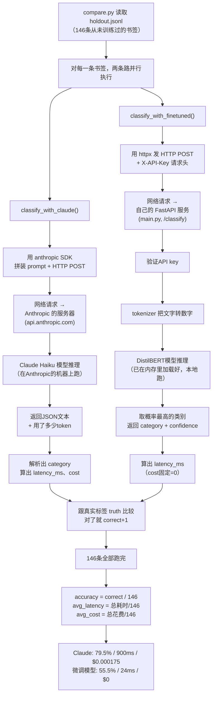

# classify API 相关问答

> 09.30整理。同一份内容也存在 Jetstar 面试准备文件（`学习-相关/求职-cover-letter/saved-工作JD/Jetstar-AI-Solutions-Delivery-Specialist/09.25-面试准备-Murtaza-Eloy.md`）里，这里是给这个项目本身留一份独立记录。

## classify API 在哪里——两个地方，容易搞混

### 1. 生产环境真实在用的分类逻辑——`lib/claude.ts`

**路径**：`AI现在项目/6-bookmark/linknest/lib/claude.ts`

这是 Linknest 网站**真实处理用户书签分类**的代码，调用 Claude Haiku：

```ts
// lib/claude.ts
export async function classifyBookmark(input: {...}) {
  const msg = await getClient().messages.create({
    model: CHEAP_CHAT_MODEL,   // 来自 lib/model-router.ts
    max_tokens: 128,
    ...
  });
}
```

这条路径才是真正在生产环境跑的——每次有人往 Linknest 存新书签，走的就是这个文件。

### 2. Benchmark 用的自托管分类服务——本仓库 `app/main.py` 的 `/classify` 端点

```python
# app/main.py
@app.post("/classify", response_model=ClassifyResponse)
def classify(body: ClassifyRequest, x_api_key: str | None = Header(default=None)):
    check_auth(x_api_key)
    text = f"{body.title} {body.description}".strip()
    inputs = ml["tokenizer"](text, truncation=True, padding=True, max_length=128, return_tensors="pt")
    with torch.no_grad():
        logits = ml["model"](**inputs).logits
        probs = torch.softmax(logits, dim=-1)[0]
    top_id = int(torch.argmax(probs).item())
    return ClassifyResponse(
        category=ml["model"].config.id2label[top_id],
        confidence=round(float(probs[top_id]), 4),
    )
```

这是**独立的 FastAPI 服务**，只用来跟 Claude Haiku 做对比实验，**没有接入 Linknest 生产流量**。唯一的调用方是本仓库的 `eval/compare.py` 对比脚本。诚实的说法：这个API只是自己写的评估脚本在调用，不是生产功能。

### 一句话区分

| | `lib/claude.ts` | `app/main.py` 的 `/classify` |
|---|---|---|
| 谁在用 | Linknest真实用户，生产环境 | 只有本仓库的 `eval/compare.py` |
| 调用什么 | Claude Haiku API（走网络到Anthropic） | 自己微调的DistilBERT（本地内存推理） |
| 性质 | 生产功能 | 一次性benchmark基础设施 |

## benchmark百分比具体怎么算出来的

### 数据从哪来

- `training/training-data.jsonl`：971条训练数据，从Linknest真实数据库导出
- `eval/holdout.jsonl`：146条留出测试数据，训练时完全没用过
- 两者加起来1117条同一批真实标注书签，按训练/测试提前分好

holdout这146条书签，DistilBERT训练时一眼都没见过，保证测出来的准确率是真实泛化能力，不是背答案。

### `compare.py`怎么跑

对holdout.jsonl里每一条书签，两条路并行执行：

```python
c_cat, c_ms, c_cost = classify_with_claude(title, description)      # 真的调Claude Haiku API
f_cat, f_ms, f_cost = classify_with_finetuned(title, description)   # 真的调自己的FastAPI服务
```

**Claude那条**：把书签标题/简介拼进prompt，真实调用`claude-haiku-4-5-20251001`，记录三件事：花了多久（`latency_ms`）、花了多少钱（`msg.usage.input_tokens`/`output_tokens`乘以Haiku官方单价）、猜的类别对不对。

**微调模型那条**：调用自己部署的`/classify`接口（本地FastAPI服务），同样计时、拿结果、记`cost=0`。

### 准确率、延迟、成本怎么算

```python
claude_correct += c_cat == truth      # 猜对了就+1
accuracy = claude_correct / n         # 79.5% = 116/146 ≈ 79.5%
avg_latency = claude_latency_total / n
avg_cost = claude_cost_total / n
```

没有任何花哨统计手段，就是146条里各自猜对了多少条除以146，延迟成本同样是总数除以146的算术平均。37倍速度差就是`900ms / 24ms ≈ 37.5`。

### 为什么55.5%看起来"低"，真实核实过的根因

holdout.jsonl这146条的真实类别分布：

```
27 Technology   20 Education    18 Finance
12 Productivity 11 Reference    11 Shopping
 9 Travel        8 Entertainment 7 Business
 7 Health        6 Social        6 Design
 2 Politics      1 Sports        1 Food
```

17个类别，测试集里3个类别（Politics/Sports/Food）总共加起来才4条样本，训练集里这些少数类别样本数量也严重不足——这就是README里"class imbalance"的真实证据。模型在样本多的类别大概率学得不错，样本极少的类别几乎没见过几个例子，容易全错，拉低整体准确率。

**09.30已给`eval/compare.py`加了per-class precision/recall/F1和混淆矩阵**（`sklearn.metrics.classification_report`/`confusion_matrix`），能直接看出具体是哪些类别在拖后腿，不是含糊地说"整体55.5%"。语法检查通过，还没实际跑（跑需要真实API key和已部署服务，会产生真实调用费用）。

## 两条API调用具体怎么"呼叫"的

### classify_with_claude——走网络，调Anthropic的服务器

```python
msg = anthropic_client.messages.create(
    model="claude-haiku-4-5-20251001",
    max_tokens=64,
    messages=[{"role": "user", "content": prompt}],
)
```

`anthropic_client`是`anthropic`这个Python SDK的实例。调用`.messages.create()`时SDK在背后做的事：(1) 把model/max_tokens/messages打包成HTTP POST请求；(2) 带上API key，发到Anthropic的服务器（api.anthropic.com）；(3) Anthropic那边让Claude Haiku跑一遍生成回复；(4) 结果通过网络传回来，SDK解析成`msg`对象，含`msg.content[0].text`（模型说的话）和`msg.usage.input_tokens`/`output_tokens`（token数算钱）。这一路要经过真实网络往返，是延迟900ms的主要原因。

### classify_with_finetuned——走网络，但调自己的服务器

```python
resp = httpx.post(
    f"{SERVICE_URL}/classify",
    json={"title": title, "description": description},
    headers={"X-API-Key": SERVICE_API_KEY},
    timeout=30,
)
```

`httpx`是通用HTTP请求库。往`SERVICE_URL`（比如`http://localhost:8000`或部署到Render后的地址）发HTTP POST请求，带书签标题描述和`X-API-Key`头做身份验证。接收方是自己写的FastAPI服务（`app/main.py`），不是别人的服务器。

**关键点**：DistilBERT模型在服务器启动时**一次性加载进内存**（`lifespan`那段代码），每次`/classify`请求进来，只是拿内存里已加载好的模型直接推理，不需要每次重新下载模型、不需要再对外调用别的服务。这是只要24ms的原因。

## 流程图



## 面试可以直接讲的一句话

> "我没有让两个模型自己报自己的分数，是写了同一个脚本、同一批holdout数据、同时调两边接口、用同一个对/错标准去数，谁也没法作弊。速度和成本是真实计时和真实token单价算出来的，不是估的。"
